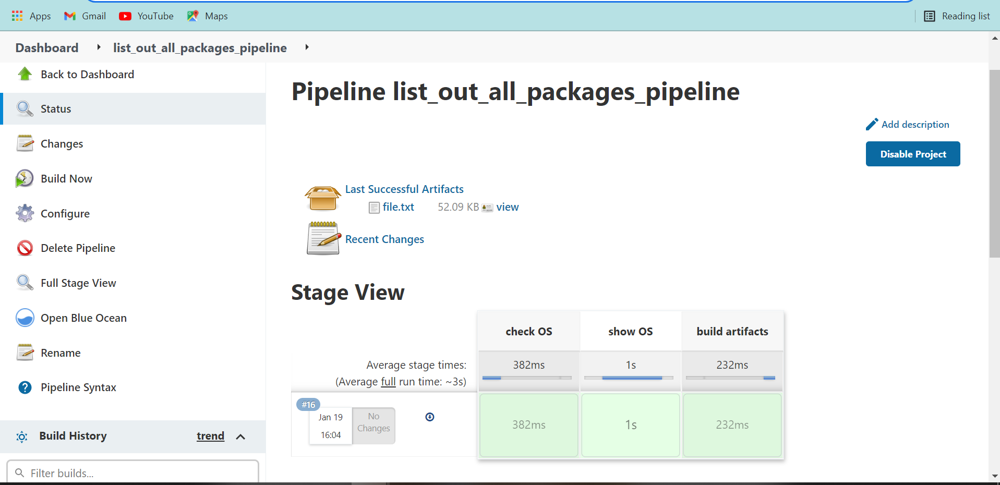
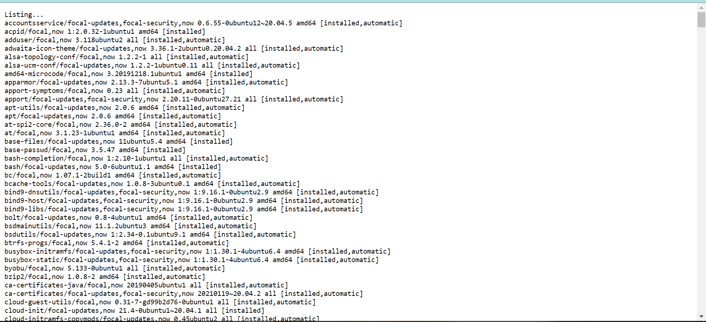
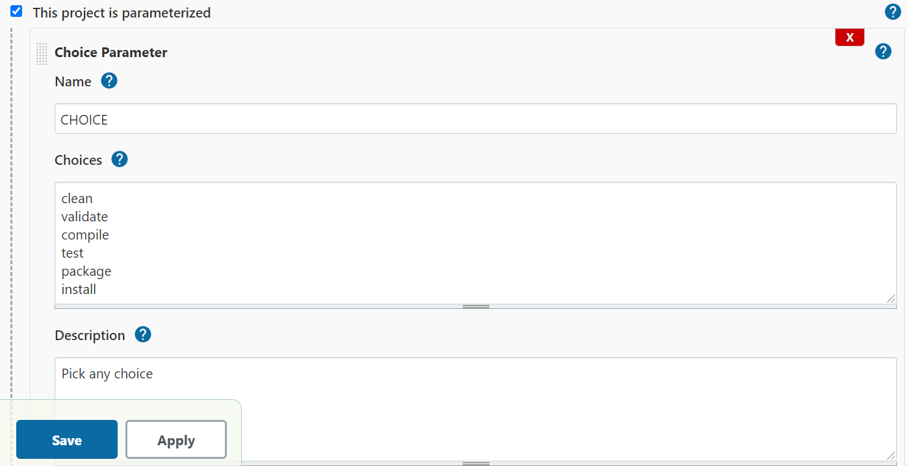
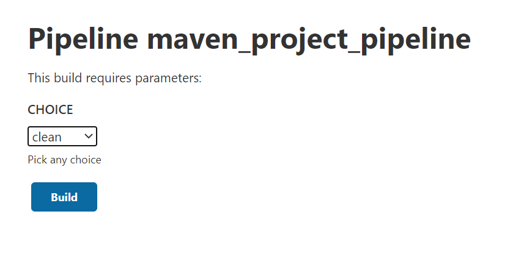

# CI/CD Assigment: DAY7

### Scripted pipeline
## Authors

### Simranjeet Singh
## TO DO

##### Consider a scenario where we would like to list out all the "installed packages(linux OS) on our machines via a Jenkins pipeline based on the OS of our machine,Eg., if the OS is linux then execute a bash script to get all the installed packages and store them in a file and finally when the execution is done we would like to view the file in our Jenkins UI itself.

#### We have Made a Script and using that script we are going to implement and run the script.

#### Now we have build our pipeline and run the pipeline. Now the Artifact file.txt is shows in the upper part. Now Showing the file.txt Content.

### BOOM !! All the Packages has been listed.

##### Create a CI pipeline for our maven based application where we would like to get a list of all the goals(mvn commands) as the parameters which we can select from and based on our choice only that goals(mvn commands) should be executed.

##### We have to pass the parameter in our job as given below.

##### We have to Choose one choice. In our case i have choose validate.

Now showing you the magic in the Snagit below.

## BOOM !! OUR script Rocks.

