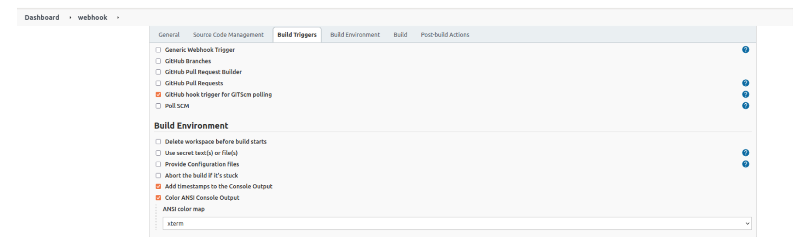
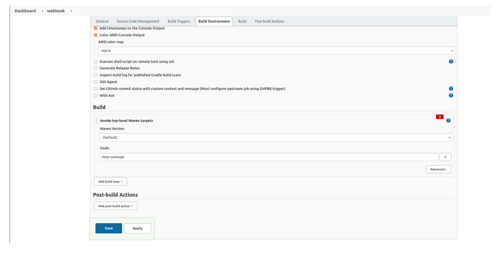
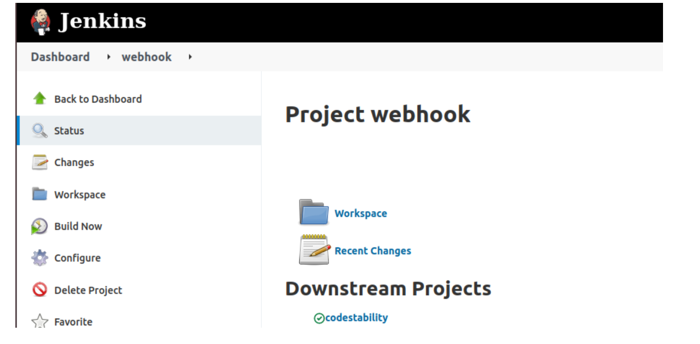
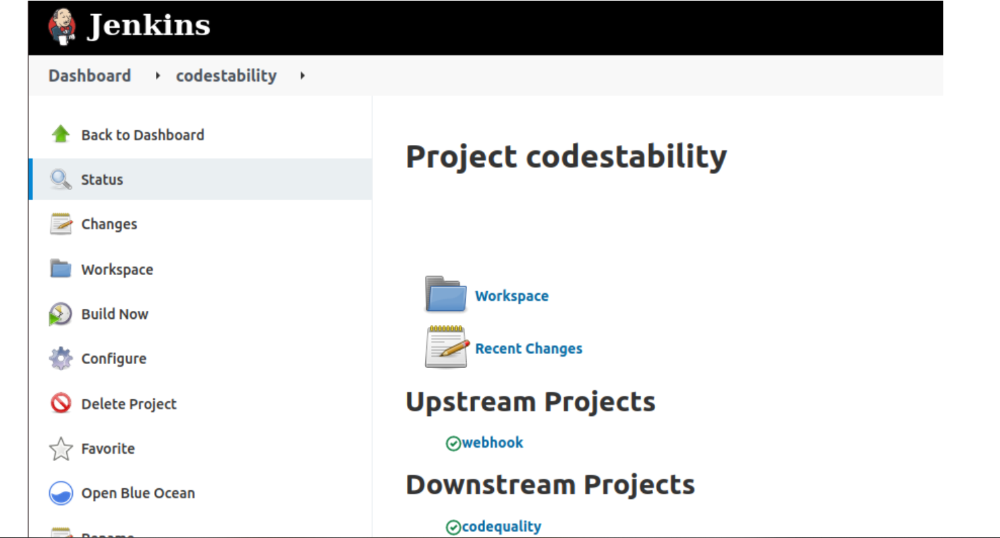

# CI/CD Assigment: DAY5

### Have to Jobs and followings are in TO-DO
## Authors

### Simranjeet Singh
## TO DO

### CI/CD Day 5 Assignment

#### Create a Jenkins job that will kick start the CI process if a commit is made.

#### Steps

- Downlod Plugin - GitHub Weebhook.

### Add a downstream Jenkins job that will perform code stability analysis.

### Add a downstream Jenkins job that will perform code quality analysis.
### If any of the step fails a Slack and Email notification should be sent.
### Also enable quality check reporting in Jenkins & Sonarqube